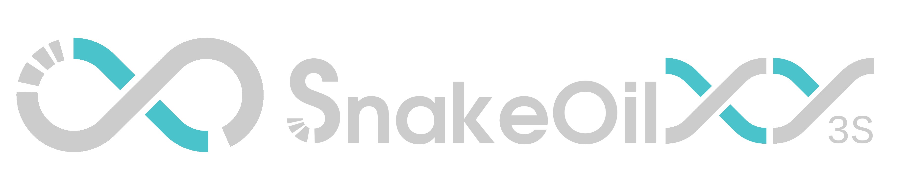

# SnakeOilXY-3S
Entry level, low cost mod for Kingroon KP3S 3D printer.

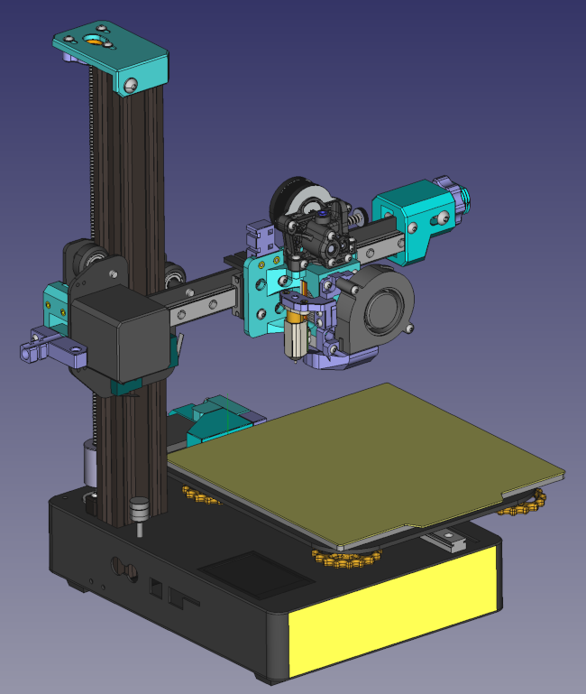

## 1. Introduction

Kingroon KP3/3S is a nice small printer, but it comes with some mechanical design problems. This mod is aiming at fixing there problem with the lowest cost as possible.

## 2. The problems and solutions

### 2.1. X and Y axis

- There is no proper way to adjust the belt tension of X and Y axis
- The belt path is not straight. This will affect the printed part dimension based on where it printed on the build place, special on large model.

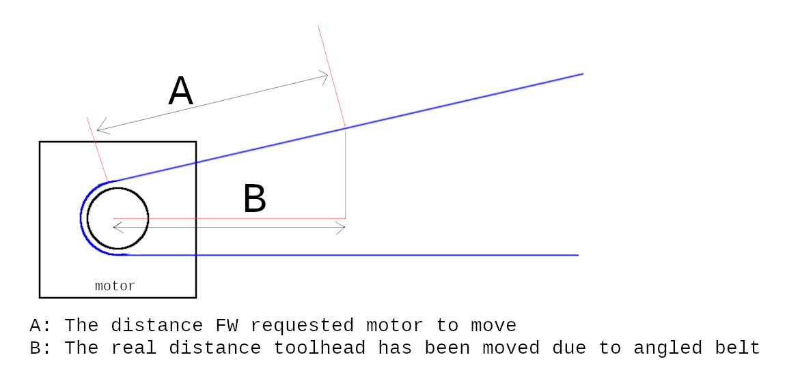

- This mod added belt tensioner for X and Y axis.
- Change the belt mounting method to make the belt path straight.(check image bellow, this method apply for both X and Y belt).
- All motor shafts are supported by bearing.

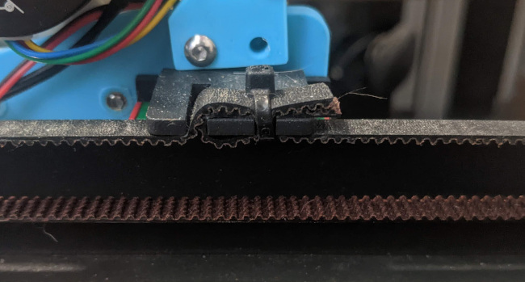
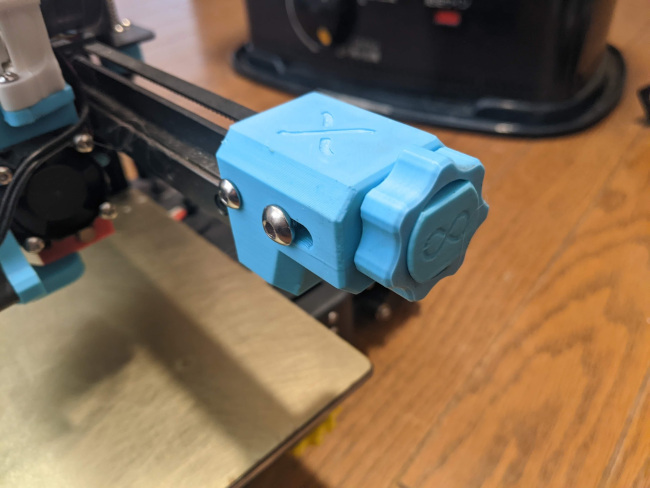
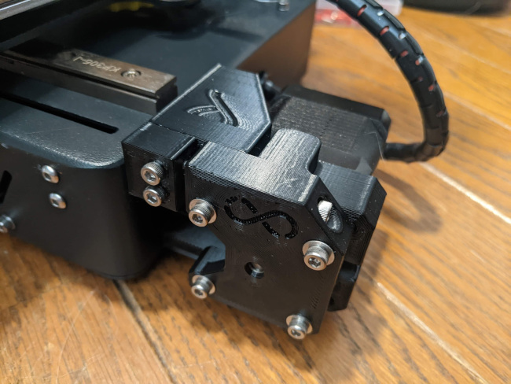
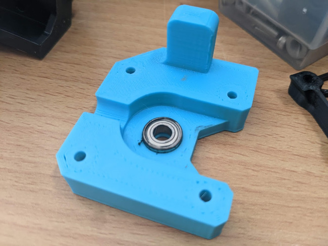

### 2.2. Z axis

- On some revisions of KP3/S the Z motor center and leadscrew nut are not well aligned. This will make the leadscew wobble and result in Z banding problem. 
- This mod added Oldham coupler and Position adjustable top support bearing. 
- Position adjustable top support bearing will allow to fine-adjust the leadscrew position so it parallel to the Z v-slot extrusion.
- Oldham coulper will deal with axial and angular misalignments of the leadscew nut.

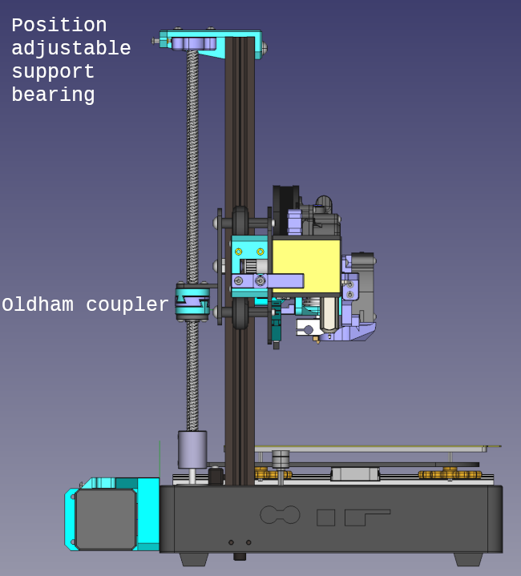
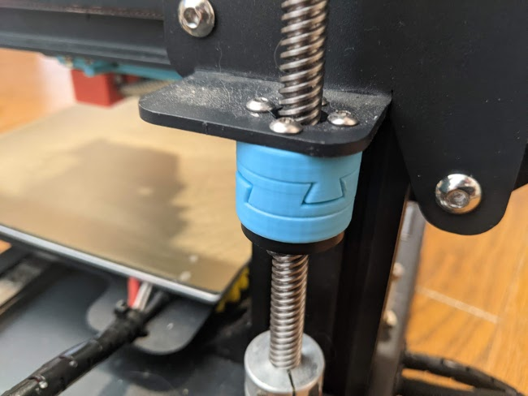
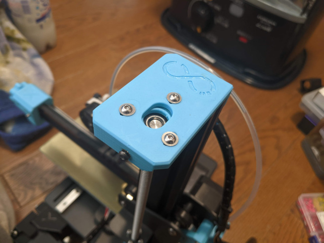

### 2.3. E axis (optional)

- There is no problem with the original extruder except it too heavy for the unsupported gantry. 
- This mod added 2 options for lighter extruder: Direct drive Sherpa mini mount and bowden extruder mount. 
- The above extruder mounters can be use with V6 hotend or any other hotend using the same mounting method(Dragon hotend with groove adapter for example).
- Optional mounting slot for BLtouch/3Dtouch
- Compatible with [bear_extruder_and_x_axis](https://github.com/gregsaun/bear_extruder_and_x_axis) fan duct and other 3rd party ducts like [RH_Dreambox's Air nozzle for the Bear extruder (Rev.1)](https://www.thingiverse.com/thing:3390107) or [MajorOCD's Fan Duct for Bear Extruder](https://www.thingiverse.com/thing:3855570)

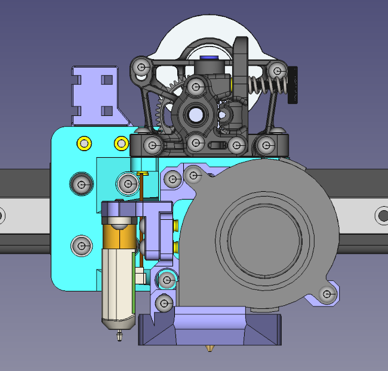
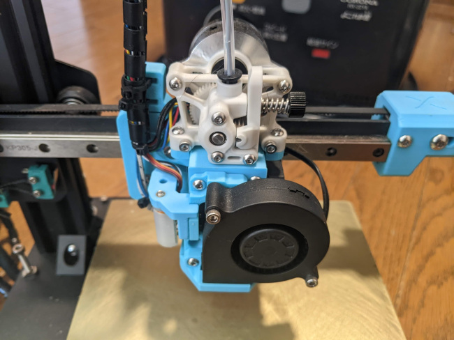

### 2.4. Klipper config

- will be added soon

## 3. Bill of materials

<table>
    <thead>
        <tr>
            <th>Item</th>
            <th>Quantity</th>
            <th>Description</th>
            <th>link</th>
        </tr>
    </thead>
    <tbody>
        <tr>
            <td>M3x4-HeatSet</td>
            <td>100</td>
            <td>M3 X D4.2 X L4.0</td>
            <td><a href="https://s.click.aliexpress.com/e/_Ad1n92" rel="nofollow">Aliexpress</a></td>
        </tr>
        <tr>
            <td>MR115 bearing</td>
            <td>2</td>
            <td></td>
            <td><a href="https://s.click.aliexpress.com/e/_De3O1rt" rel="nofollow">Aliexpress</a></td>
        </tr>
        <tr>
            <td>626 bearing</td>
            <td>1</td>
            <td></td>
            <td><a href="https://s.click.aliexpress.com/e/_DmHvzmn" rel="nofollow">Aliexpress</a></td>
        </tr>
        <tr>
            <td>20T 6mm Tooth Idler (5mm bore)</td>
            <td>2</td>
            <td>Only E3D's Gates idler or Mellow's Gates idler will fir</td>
            <td><a href="https://s.click.aliexpress.com/e/_Ad1n92" rel="nofollow">Aliexpress</a></td>
        </tr>
        <tr>
            <td>6mm 2GT belt</td>
            <td>1.5~2m</td>
            <td>M3 X D4.2 X L4.0</td>
            <td><a href="https://www.Aliexpress.com/item/32952396111.html" rel="nofollow">Aliexpress</a></td>
        </tr>
        <tr>
            <td>4x5x12mm brass tube (IDxODxLength)</td>
            <td>1</td>
            <td>Can be cuted from longer tube</td>
            <td><a href="https://s.click.aliexpress.com/e/_DC6Dbc3" rel="nofollow">Aliexpress</a></td>
        </tr>
        <tr>
            <td>Sherpa mini extruder kit</td>
            <td>1</td>
            <td>Direct extruder parts - OPTIONAL</td>
            <td><a href="https://s.click.aliexpress.com/e/_DmmcVKn" rel="nofollow">Aliexpress</a></td>
        </tr>
        <tr>
            <td>5015 blower fan</td>
            <td>1</td>
            <td>Direct extruder parts - OPTIONAL</td>
            <td><a href="https://s.click.aliexpress.com/e/_DllkWdp " rel="nofollow">Aliexpress</a></td>
        </tr>
        <tr>
            <td>3010 fan</td>
            <td>1</td>
            <td>Direct extruder parts - OPTIONAL</td>
            <td><a href=" https://s.click.aliexpress.com/e/_DlSF5np" rel="nofollow">Aliexpress</a></td>
        </tr>
        <tr>
            <td>PTFE tube clip set</td>
            <td>2</td>
            <td>Extruder parts - OPTIONAL</td>
            <td><a href="https://s.click.aliexpress.com/e/_DEVMtuF" rel="nofollow">Aliexpress</a></td>
        </tr>
        <tr>
            <td>Bolts and nuts</td>
            <td>?</td>
            <td>Work-in-Progress</td>
            <td></td>
        </tr>
    </tbody>
</table>

## 4. How to print parts

- PETG, ABS or PC filament depend on your budget and how hot you will run the printer.
- 0,4mm nozzle, 0.2mm layer height, 5 walls, 30% infill
- Oldham coupler will need to be printed with small layer height(0.05~0.1mm) and small diameter nozzle(~0.25mm) if possible. This parts will need some sanding to make the mating surface smooth enough.

## 5. Copyright Notice

- [Sherpa mini extruder](https://github.com/Annex-Engineering/Sherpa_Mini-Extruder) is an original work of [Annex Engineering](https://github.com/Annex-Engineering), modified parts using their source code/design files are re-released under [ANNEX Engineering License](https://github.com/Annex-Engineering/ANNEX-Engineering-License-Agreement/blob/main/LICENSE.md).
- [bear_extruder_and_x_axis](https://github.com/gregsaun/bear_extruder_and_x_axis) is an original work of [Grégoire Saunier](https://github.com/gregsaun), modified parts using their source code/design files are re-released under [GNU General Public License v3.0](https://github.com/gregsaun/bear_extruder_and_x_axis/blob/master/LICENSE)
- The CAD assembly using Kingroon KP3/S model of [Fukuma Yohei](https://www.thingiverse.com/fukumay/designs) at [Thingiverse - Kingroon KP3S full assembly STP/OBJ data](https://www.thingiverse.com/thing:4889303) under [Creative Commons - Attribution license](https://creativecommons.org/licenses/by/4.0/)
- This printer design(SnakeOilXY-3S), it's document and software are released under [GNU General Public License v3.0](https://github.com/ChipCE/SnakeOil-XY/blob/master/LICENSE)
